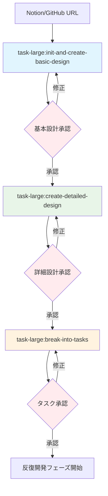
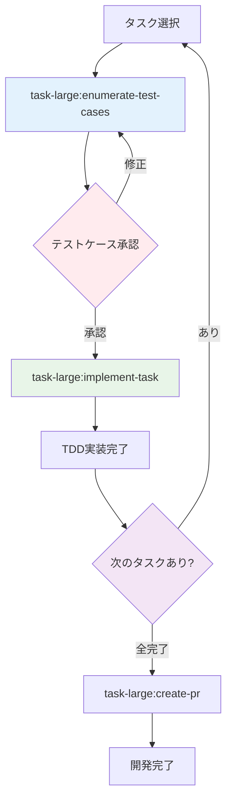
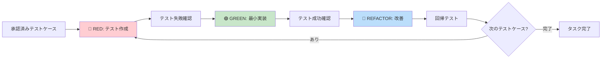

# 大・中規模タスク開発フロー (task-large)

このドキュメントでは、Claude Codeの`task-large`ディレクトリ配下の大・中規模タスク向けコマンド群を使った体系的な開発フローについて解説します。

## 概要

大・中規模タスク開発フローは、**TDD（テスト駆動開発）**と**人間承認プロセス**を組み合わせた高品質なソフトウェア開発手法です。

### 主な特徴

- 📋 **仕様管理**: Notion/GitHubからの仕様初期化と段階的設計
- 🧪 **テスト駆動**: 事前承認されたテストケースに基づくTDD開発
- 👥 **人間承認**: 各段階での品質チェックポイント
- 📊 **進捗追跡**: JSON形式での詳細な進捗管理
- 🔄 **反復開発**: タスク単位でのテストケース列挙→実装サイクル

### 開発フローの利点

1. **品質保証**: 事前にテストケースを人間が承認することで品質を担保
2. **体系的開発**: 仕様→設計→タスク→テスト→実装の明確なフロー
3. **チーム開発**: 進捗の可視化とレビュープロセスの組み込み
4. **再現性**: 承認されたテストケースによる一貫した実装品質

## 全体ワークフロー

### メインフロー（プロジェクト初期化）



### 反復開発フロー（各タスクごと）



### TDD実装サイクル（implement-task内部）



## 利用可能コマンド

### 1. init-and-create-basic-design

**目的**: プロジェクトの仕様を初期化し、基本設計を作成

**使用方法**:
```bash
/task-large:init-and-create-basic-design <Notion/GitHub URL> [Figma URL]
```

**機能**:
- Notion/GitHubページから要件を抽出
- 基本設計書（basic-design.md）を生成
- メタデータ（spec.json）を初期化
- 必要なディレクトリ構造を作成

**生成ファイル**:
- `.specs/<機能名>/basic-design.md`
- `.specs/<機能名>/spec.json`
- その他のテンプレートファイル

### 2. create-detailed-design

**目的**: 基本設計から詳細設計を作成

**使用方法**:
```bash
/task-large:create-detailed-design <機能名>
```

**前提条件**: 基本設計が承認済みであること

**機能**:
- 基本設計に基づく詳細な技術設計
- 実装フェーズの計画
- 技術リスクの分析

### 3. break-into-tasks

**目的**: 詳細設計を実装可能なタスクに分割

**使用方法**:
```bash
/task-large:break-into-tasks <機能名>
```

**機能**:
- 1-2時間で完了可能なタスクに分割
- タスク間の依存関係を定義
- testcases/ディレクトリとtask-progress.jsonを自動作成
- カテゴリ別タスク分類（CORE, UI, API, INFRA, DOC）

**生成ファイル**:
- `.specs/<機能名>/tasks.md`
- `.specs/<機能名>/testcases/` (ディレクトリ)
- `.specs/<機能名>/task-progress.json`

### 4. enumerate-test-cases

**目的**: 指定されたタスクのテストケースを列挙し、人間承認を得る

**使用方法**:
```bash
/task-large:enumerate-test-cases <機能名> <タスクID>
```

**機能**:
- 正常系・異常系・エッジケース・統合テストケースの網羅的列挙
- testcases/ディレクトリにMarkdownファイルとして保存
- 人間承認プロセス
- task-progress.jsonへの進捗記録

**生成ファイル**:
- `.specs/<機能名>/testcases/<タスクID>.md`

### 5. implement-task

**目的**: TDD（RED-GREEN-REFACTOR）サイクルでタスクを実装

**使用方法**:
```bash
/task-large:implement-task <機能名> [タスクID]
```

**前提条件**: テストケースが承認済みであること

**機能**:
- 承認されたテストケースに基づくTDD実装
- RED-GREEN-REFACTORサイクルの実行
- 依存関係の確認と実装順序の決定
- 品質チェック（テスト実行、静的解析）

### 6. check-status

**目的**: プロジェクトの現在の進捗状況を確認

**使用方法**:
```bash
/task-large:check-status <機能名>
```

**機能**:
- 各フェーズの進捗状況表示
- タスクの完了状況表示
- 次に実行すべきアクションの提案

### 7. create-pr

**目的**: 実装完了後のプルリクエストを作成

**使用方法**:
```bash
/task-large:create-pr <機能名>
```

**機能**:
- 実装内容のサマリー作成
- テスト結果の確認
- プルリクエストの自動生成

## ディレクトリ構造

```
.specs/<機能名>/
├── basic-design.md          # 基本設計書
├── detailed-design.md       # 詳細設計書
├── tasks.md                 # タスク定義
├── spec.json               # 仕様メタデータ
├── task-progress.json      # タスク進捗管理
└── testcases/              # テストケースファイル
    ├── TASK-001.md
    ├── TASK-002.md
    └── ...
```

### ファイルの役割

#### spec.json（仕様レベル管理）
- 基本設計、詳細設計、タスクの生成・承認状況
- 仕様全体のフェーズ管理
- メタデータ（複雑度、優先度など）

#### task-progress.json（タスクレベル管理）
- 個別タスクの詳細進捗管理
- テストケース承認状況
- 見積時間、依存関係、完了日時
- 実装開始・完了の記録

#### testcases/<タスクID>.md
- 承認されたテストケース一覧
- 正常系・異常系・エッジケース・統合テストの分類
- テスト実装方針

## 実践例

### 例: フィルター機能の開発

#### 1. 仕様初期化
```bash
/task-large:init-and-create-basic-design https://notion.so/example-feature
```

#### 2. 詳細設計作成
```bash
/task-large:create-detailed-design filter-feature
```

#### 3. タスク分割
```bash
/task-large:break-into-tasks filter-feature
```

#### 4. 各タスクの反復実装
```bash
# タスク1: テストケース列挙→実装
/task-large:enumerate-test-cases filter-feature CORE-001
# ↓ 人間承認
/task-large:implement-task filter-feature CORE-001

# タスク2: テストケース列挙→実装
/task-large:enumerate-test-cases filter-feature UI-001
# ↓ 人間承認
/task-large:implement-task filter-feature UI-001

# ... 全タスク完了まで反復
```

#### 5. プルリクエスト作成
```bash
/task-large:create-pr filter-feature
```

### TDD実装の流れ（implement-task内部）

1. **REDフェーズ**: 承認されたテストケースをDartテストに変換
   ```bash
   fvm flutter test test/filter_test.dart  # 失敗確認
   ```

2. **GREENフェーズ**: テストを通す最小限の実装
   ```bash
   fvm flutter test test/filter_test.dart  # 成功確認
   ```

3. **REFACTORフェーズ**: コード品質改善
   ```bash
   fvm flutter test test/filter_test.dart  # 回帰テスト
   ```

## 品質保証のポイント

### 人間承認チェックポイント

1. **基本設計承認**: 機能の目的と範囲が適切か
2. **詳細設計承認**: 技術設計が実装可能で適切か
3. **タスク承認**: タスク分割が適切で実装可能か
4. **テストケース承認**: テストケースが網羅的で適切か

### 自動品質チェック

- 全テストの実行と成功確認
- 静的解析（`fvm flutter analyze`）
- コードフォーマットの確認
- 依存関係の整合性確認

## まとめ

大・中規模タスク開発フローは、**テストケース列挙→実装の反復サイクル**により、各タスクで確実な品質保証を行いながら開発を進める手法です。人間の判断による品質チェックとTDDによる実装品質の担保を組み合わせることで、高品質なソフトウェアを効率的に開発できます。

### 次のステップ

1. プロジェクトの要件をNotion/GitHubに整理
2. `/task-large:init-and-create-basic-design`で開発開始
3. 各フェーズでの承認プロセスを確実に実行
4. タスク単位でのテストケース→実装サイクルを継続