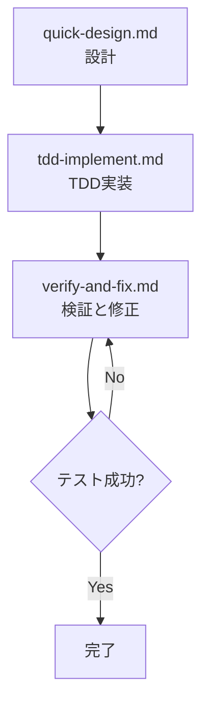

# 小規模タスク開発フロー (task-small)

小規模タスク向けの簡潔な AI 開発コマンド集です。各フェーズで人間のレビューと修正を前提としています。

## 開発フロー



## コマンド一覧

### 1. 📝 quick-design.md

**用途**: 参考ドキュメントを基にした基本設計と詳細設計の統合
**使用タイミング**: タスク開始時（参考ドキュメントを読み込んだ後）

```
- 参考ドキュメント（要件定義、API仕様等）の読み込みと理解
- タスクの影響範囲の特定
- 実装方針とタスク分解
- エッジケースの洗い出し
```

**必須**: 実行前に `@ファイルパス` で参考ドキュメントを指定すること

### 2. 🔄 tdd-implement.md

**用途**: TDD手法による実装（テスト作成→実装→リファクタリング）
**使用タイミング**: 設計後の実装フェーズ

```
- 仕様からテストケース設計
- 正常系・異常系・エッジケースの網羅的テスト
- RED → GREEN → REFACTOR サイクル
- Arrange-Act-Assertパターン
```

### 3. ✅ verify-and-fix.md

**用途**: テスト実行と問題修正
**使用タイミング**: 実装後の検証フェーズ

```
- テスト実行と結果分析
- エラーの分類と修正
- 品質チェック（カバレッジ、静的解析）
```

## 推奨ワークフロー

### 標準的な実装フロー（推奨）

```bash
# ステップ1: 参考ドキュメントを明示的に指定して設計
@./docs/requirements.md @./docs/api-spec.md を参考にして
/task-small:quick-design

# ステップ2: TDD実装（設計を基にテスト作成→実装→リファクタリング）
/task-small:tdd-implement

# ステップ3: 検証と修正
/task-small:verify-and-fix
```

**重要**: 必ず最初に `@ファイルパス` で参考ドキュメントを指定してください。これにより：
- AIが正確な要件を理解できる
- 既存の規約やガイドラインに沿った設計が可能
- ドキュメントとコードの整合性が保たれる

## 重要な原則

### ✅ 必須事項

- **テストケースは仕様から作成**（コードを見ない）
- **エッジケースを必ず含める**
- **RED フェーズを確認**（テストが失敗することを確認）
- **各フェーズで人間のレビュー**

### ❌ 禁止事項

- コードを先に書く
- エッジケースを省略する
- テストなしで実装を進める
- RED フェーズをスキップする

## 使用例

### 例1: ログイン機能のエラーメッセージ改善

```bash
# 1. 設計フェーズ
/task-small:quick-design
# → 影響範囲、実装方針、タスク分解を明確化

# 2. TDD実装フェーズ
/task-small:tdd-implement
# → テストケース作成 → テストコード → RED確認 → 実装 → GREEN確認

# 3. 検証フェーズ
/task-small:verify-and-fix
# → 全テスト実行 → カバレッジ確認 → 静的解析
```

### 例2: 既存仕様書を参考にした機能追加

```bash
# 既存の仕様書を参考にして新機能を追加
@./specs/user-auth.md と @./specs/api-guidelines.md を参考にして
パスワードリセット機能を追加したい

/task-small:quick-design
# → 既存仕様を考慮した設計

/task-small:tdd-implement  
# → 既存の規約に従ったテストと実装
```

## チェックポイント

各フェーズの完了時に以下を確認：

| フェーズ    | チェック項目                                       |
| ----------- | -------------------------------------------------- |
| 設計        | タスク分解は明確か？エッジケースは洗い出されたか？ |
| TDD実装     | 仕様ベースか？RED→GREEN→REFACTORサイクルか？      |
| 検証        | 全テスト成功？カバレッジ 80%以上？静的解析クリア？ |

## 関連リンク

- [大・中規模タスク開発フロー](task-large.md) - 大規模・中規模タスク向け
- [t-wada の TDD](https://t-wada.hatenablog.jp/) - TDD の参考資料
